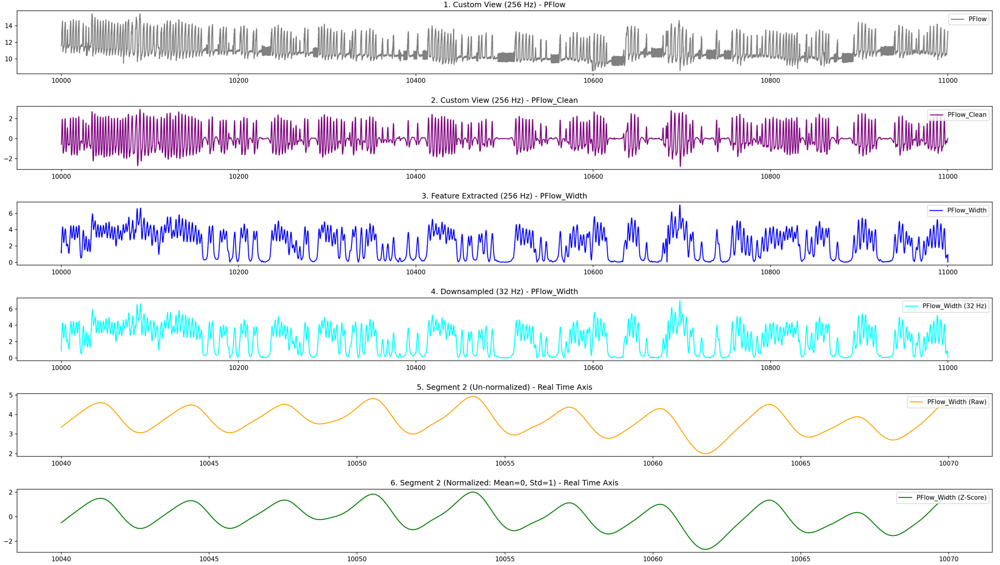

# 🩺 Clinical-Apnea-Scorer-AI: Dual-Expert RLHF Pipeline

A complete end-to-end Machine Learning pipeline designed to process raw Polysomnography (PSG) sleep data and autonomously classify Central Apnea (CA) and Obstructive Sleep Apnea (OSA). 

This project progresses from classical digital signal processing to Supervised Fine-Tuning (SFT) of dual Bidirectional LSTMs, culminating in a Reinforcement Learning from Human Feedback (RLHF) agent utilizing Proximal Policy Optimization (PPO), Active Learning, and MLflow for experiment tracking.

> **🔒 Data Privacy Notice (Datenschutz):** Raw `.csv` clinical patient data, `.npy` feature arrays, and MLflow local databases (`mlruns/`) have been excluded from this repository in compliance with GDPR and medical data privacy standards.

## 🧠 System Architecture & Workflow

### 1. Advanced Signal Processing & Feature Engineering
Raw biological signals are inherently noisy and highly variable between patients. The `apnea-signal-processing.py` script standardizes the data using physiological principles:
* **Signal Cleaning:** Applied bidirectional Butterworth Band-Pass filters (`filtfilt`) to airflow and respiratory effort channels to remove artifact noise without inducing phase shifts.
* **Amplitude Enveloping:** Extracted instantaneous tidal volume using the Hilbert Transform to calculate upper and lower signal envelopes.
* **Physiological Logic:** Engineered domain-specific features, including:
  * *Thorax-Abdomen Cross-Correlation:* To detect Paradoxical Breathing (chest and stomach fighting each other), the hallmark of Obstructive Apnea (OSA).
  * *Effort-Flow Ratio:* To differentiate Central Apnea (where both drop) from Obstructive Apnea (where effort spikes while flow drops).
* **Segment-Wise Normalization:** Applied Z-score normalization (`StandardScaler`) across 30-second sliding windows to ensure the AI generalizes across different patients' baseline lung capacities.

### 2. Feature Stress-Testing (`ultimate_test.py`)
Before feeding data to the neural network, features were rigorously stress-tested using `ultimate_test.py` to ensure statistical robustness across highly imbalanced datasets (e.g., nights with 106 OSA events vs. nights with 6 CA events).

### 3. Supervised Fine-Tuning (SFT): The "Dual-Binary LSTM"
The foundational "brain" consists of two independent Bidirectional LSTMs trained on stitched, full-night datasets (`train_lstm.py`). 
* **Decoupled Architecture:** Shifted from a Multi-Class approach to a "Dual-Expert" (Binary) approach, training one dedicated model for CA and one for OSA. This prevents the LSTM from confusing the distinct physiological signatures of the two diseases.
* **Cost-Sensitive Learning:** Addressed the massive class imbalance (95% normal breathing vs. 5% apnea) by applying heavy penalty weights to the `CrossEntropyLoss` function, mathematically forcing the model to hunt for rare anomalies.
* **Time-Series Context:** Uses a 30-second window (960 timesteps at 32Hz) with a 10-second overlap, allowing the bidirectional model to look at the recovery breath *after* an event to confirm the diagnosis.

### 4. Reinforcement Learning from Human Feedback (RLHF)
To bridge the gap between messy clinical labels and physiological reality, the SFT weights were transplanted into an Actor-Critic PPO architecture (`train_rlhf_ppo.py`).
* **Active Learning:** The agent dynamically scans randomized segments. If it detects an apnea but its Softmax confidence falls below a set threshold, it pauses training, plots the feature vectors, and explicitly asks the human expert to verify the event.
* **The "Critic Firewall":** Utilized `.detach()` on the LSTM's hidden state to protect the pre-trained SFT visual cortex from being overwritten by the Critic's value gradients during PPO optimization ("Critic Hijack" prevention).
* **Dynamic Reward Scaling:** Human feedback grants point bonuses/penalties, shaping a highly conservative medical diagnostic policy to reduce false alarms.

### 5. MLOps & Event-Based Clinical Evaluation
To ensure rigorous academic reproducibility, the training loop is deeply integrated with **MLflow** and custom clinical metrics (`calculate_clinical_metrics.py`).
* **Experiment Tracking:** MLflow automatically logs all PPO hyperparameters, human intervention counts, entropy loss, and learning rates per run.
* **Event-Based Validation:** Replaced rigid frame-by-frame accuracy with a clinical "30% Overlap" rule. If the AI prediction overlaps a doctor's labeled event by 30%, it is counted as a successful Recall.
* **Unlabeled Discovery Tracking:** AI predictions that do not overlap with doctor labels are not immediately penalized as False Positives. They are tracked as "Unlabeled AI Discoveries" to be manually reviewed, allowing the AI to catch apneas the human clinician missed.
* **Model Registry:** The exact `.pth` weights of the best-performing models are automatically snapshotted and saved as MLflow artifacts.

## 🚀 Key Technologies
* **PyTorch:** Deep Learning, LSTM, PPO, Custom Loss Functions.
* **MLflow:** MLOps, Experiment Tracking, Artifact Registry, Metric Logging.
* **SciPy & Scikit-Learn:** Butterworth filters, Hilbert transforms, Morphological operations, Standardization.
* **Gymnasium (OpenAI Gym):** Custom RL environment (`apnea_env.py`) simulation for sequential medical data.
* **Pandas & NumPy:** Big-data manipulation, array stitching, and feature synthesis.
